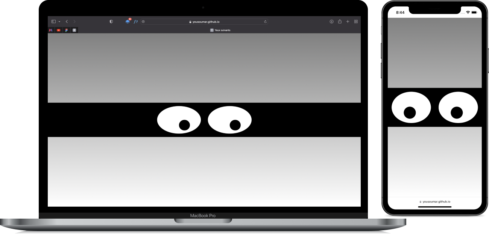

Il s'agit de coder des yeux qui suivent la souris en `HTML`, `CSS`, et `JavaScript`.

Visiter le site en cliquant sur l'image ci-dessous ou sur le lien en bas de la section `About`.

<a href = "https://yousoumar.github.io/yeux-suivants/"></img></a>
